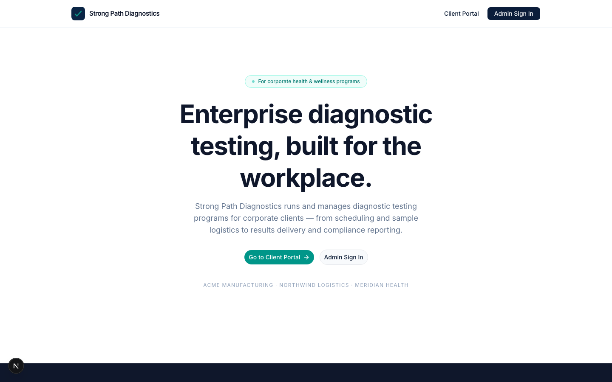
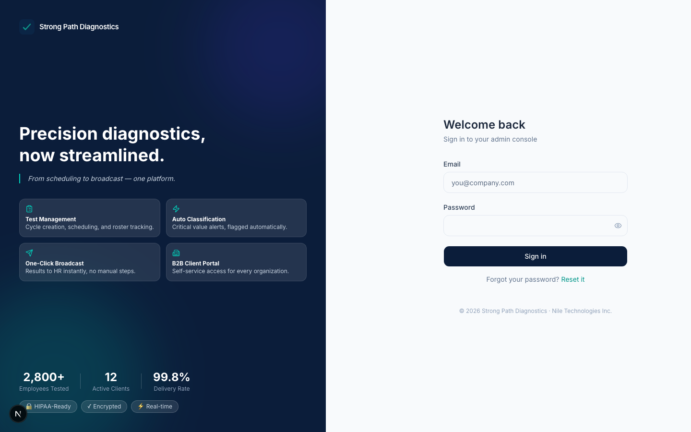
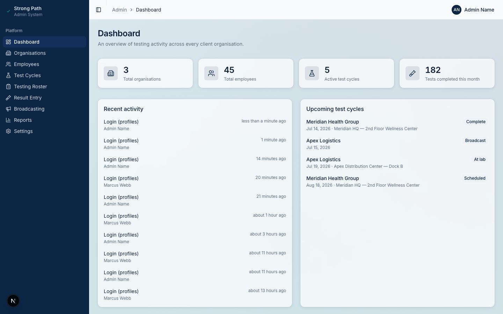
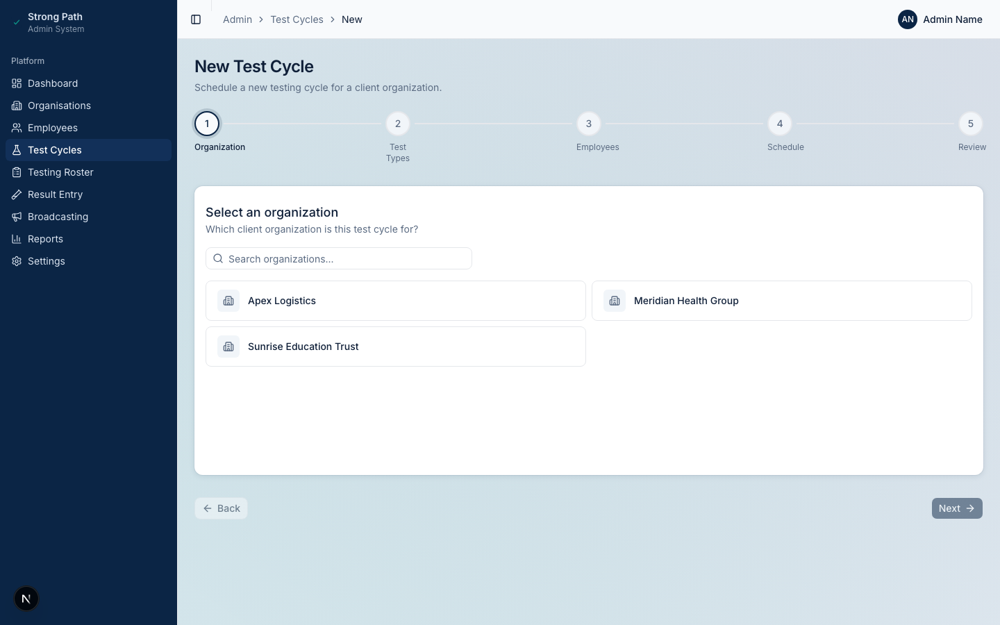
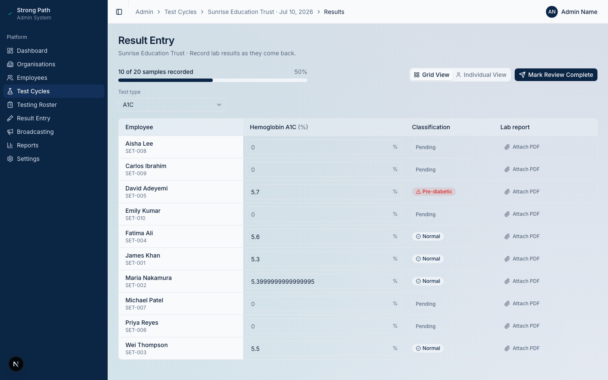
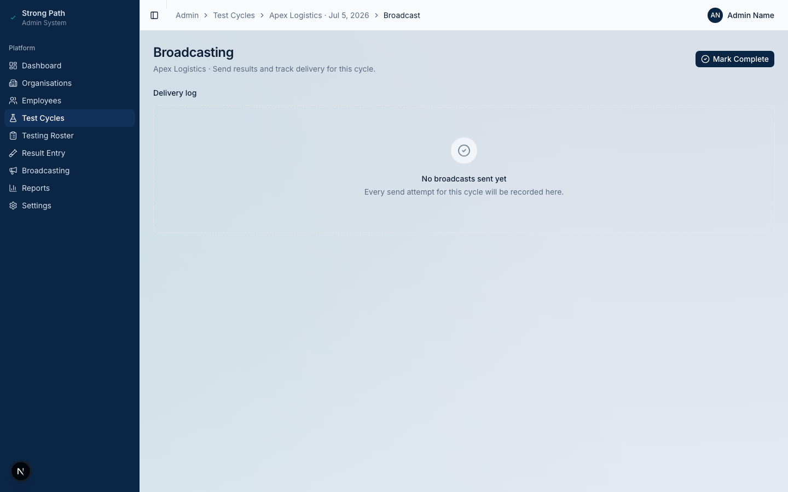
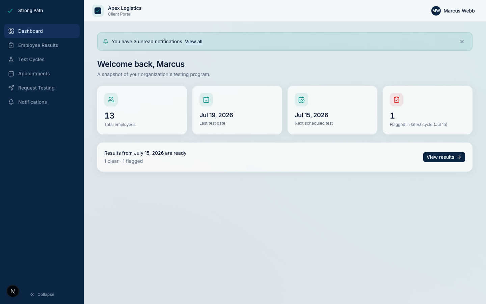
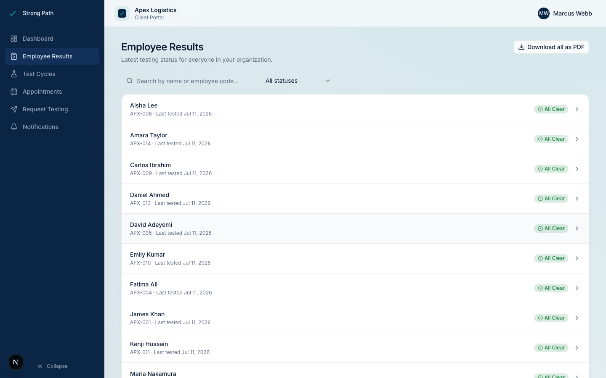
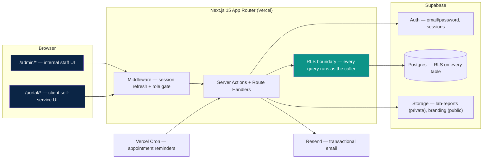

# Strong Path Diagnostics

A B2B health-testing platform: Strong Path runs on-site diagnostic testing
programs (drug screens, biometric panels, infectious disease testing) for
employers, and this app is the operational backbone — admins run the entire
testing lifecycle from scheduling through result entry to broadcast, and each
client organisation gets a self-service portal to see their own results,
review testing history, and request new cycles, without ever seeing another
company's data.

Built on Next.js 15 (App Router) and Supabase (Postgres + Auth + Storage),
with Row Level Security as the actual security boundary — not just an
app-layer convention.

## 🚀 Live Demo

**[https://strongpath-diagnostics.vercel.app](https://strongpath-diagnostics.vercel.app)**

### Admin Access
| URL | Email | Password |
|-----|-------|----------|
| [/login](https://strongpath-diagnostics.vercel.app/login) | admin@strongpathdiagnostics.com | *available on request* |

### Client Portal Access
| URL | Email | Password |
|-----|-------|----------|
| [/portal](https://strongpath-diagnostics.vercel.app/portal) | demo-apex@strongpathdiagnostics.example | *available on request* |
| [/portal](https://strongpath-diagnostics.vercel.app/portal) | demo-meridian@strongpathdiagnostics.example | *available on request* |
| [/portal](https://strongpath-diagnostics.vercel.app/portal) | demo-sunrise@strongpathdiagnostics.example | *available on request* |

## Screenshots

| | |
|---|---|
| **Landing page**  | **Login**  |
| **Admin dashboard**  | **New test cycle wizard**  |
| **Result entry**  | **Broadcasting**  |
| **Client portal dashboard**  | **Client portal results**  |

## Architecture



The two app segments (`/admin` and `/portal`) share one codebase, one
database, and one Supabase project — they're separated by role-based
middleware gating and, more importantly, by Postgres RLS policies that scope
every query to what the authenticated user is actually allowed to see. There
is no separate "portal API" with its own authorization logic to keep in sync;
the same `getResultsPageData()` used by an admin's result-entry screen is
reused by the portal's PDF export, and RLS is what makes that safe.

## Data model

13 core tables, roughly in dependency order:

- **`organisations`** — client companies. Soft-archived (`status`), never hard-deleted.
- **`profiles`** — one row per authenticated user, `role` (`admin` | `client_admin`) and `org_id` (null for admins, required for client_admins). `is_active` gates login in real time, not just at sign-in.
- **`employees`** — belong to one `organisation`. The people actually being tested.
- **`test_types`** — the catalog of available tests (A1C, Cholesterol, Drug panel, etc). `result_fields` and `classification_rules` are JSONB — see [Dynamic form engine](#dynamic-form-engine) below. Editing a test type creates a *new row* rather than mutating the old one, so historical results stay interpretable under the rules that were active when they were entered.
- **`test_cycles`** — one testing event at one organisation, moving through a 7-stage `status` pipeline (see below).
- **`cycle_test_types`** / **`cycle_employees`** — join tables: which tests run in this cycle, which employees are expected.
- **`samples`** — one row per (employee, test type) pair within a cycle; created when a vial is logged during the Testing stage.
- **`results`** — one-to-one with `samples`. Holds the raw `values` JSONB and a computed `classification` (`clear` | `flagged` | null).
- **`broadcasts`** — a log of what was sent to whom (aggregate report to the org, or an individual report to one employee) and whether it succeeded.
- **`cycle_requests`** — a client's self-service ask for a new testing cycle (preferred dates, test types, employee scope), reviewed by an admin.
- **`notifications`** — org-scoped feed items (e.g. "results are ready") shown in the portal.
- **`audit_log`** — append-only record of every mutation, written via the service-role client so it's never itself subject to RLS write restrictions.

(`company_profile` and `email_templates` are two small singleton/config
tables backing Settings — Strong Path's own branding and customizable email
copy — not part of the core testing domain.)

## Security model

**RLS is the actual boundary, not the UI.** Every table has Row Level
Security enabled, and every policy is written against two helper functions —
`is_admin()` and `current_org_id()` — both `SECURITY DEFINER` so they can read
`profiles` without themselves being blocked by `profiles`' own RLS.

- **Admins** (`is_admin()` true) can read and write everything. There's no
  organisation scoping for admin — they run the whole testing operation
  across every client.
- **`client_admin`** users can only ever see rows where `org_id =
  current_org_id()` — their own organisation's employees, cycles, results,
  requests, notifications. Cross-organisation reads don't error, they just
  return empty (that's how Postgres RLS works — a query is always "valid",
  RLS just filters the rows), and cross-organisation writes are rejected
  outright by the policy's `with_check`.
- **The broadcast gate**: a client_admin can see a `test_cycles` row the
  moment it's scheduled (so they know testing is coming), but the
  `results_select` policy additionally requires `test_cycles.status in
  ('broadcast', 'complete')` — so results are invisible in the portal until
  an admin has actually reviewed and sent them. Results entry happening
  behind the scenes is never leaked early.
- **The service-role key never reaches the client.** It's used in exactly a
  few server-only places — `lib/audit.ts` (so audit logging always succeeds
  regardless of the caller's RLS permissions) and a handful of admin-only
  invite/team actions — and every one of them is `"server-only"`-guarded so
  importing them from a Client Component fails the build, not just a code
  review.
- File access is signed-URL-only for anything sensitive: uploaded lab report
  PDFs live in a **private** Storage bucket, served via 5-minute
  `createSignedUrl()` links generated by an admin-gated server action. The
  one public bucket holds only Strong Path's own logo (needed for
  unauthenticated `` rendering in outbound emails/PDFs) — never
  client or employee data.
- Every mutation — CRUD, status transitions, broadcasts, classification
  overrides, portal invites, access revocations, and logins — writes an
  `audit_log` row with the actor, action, entity, and a diff.

## The status pipeline

A test cycle moves through exactly seven stages, strictly linearly — no
skipping ahead, no jumping back:

```
Scheduled → Testing → At Lab → Results Entry → Review → Broadcast → Complete
```

| Stage | What happens |
|---|---|
| **Scheduled** | Cycle created: org, date, location, test types, employee roster. |
| **Testing** | Samples are logged on-site (vial reference recorded per employee/test type). |
| **At Lab** | Samples sent out; nothing else changes until results come back. |
| **Results Entry** | Lab results are entered per sample; `classify()` computes clear/flagged automatically from `test_types.classification_rules`. |
| **Review** | Admin reviews entered results before anything goes out; classification overrides (with a required reason) happen here. |
| **Broadcast** | Aggregate and/or individual PDF reports are emailed out. This is also the moment results become visible in the client portal. |
| **Complete** | Cycle closed out. |

`advanceTestCycleStatus()` is the only way to move a cycle forward, and it
re-validates the transition server-side against the exact next stage in the
pipeline — a client sending a bogus or out-of-order status is rejected
regardless of what the UI shows.

## Dynamic form engine

This is the thing that makes adding a tenth test type a data change instead
of a deploy. Each `test_types` row carries two JSONB columns:

- **`result_fields`** — an array of `{ key, label, type, unit? }`. `type` is
  `number`, `text`, or `boolean`. This is the entire schema for what a lab
  result looks like for this test.
- **`classification_rules`** — an ordered array of `{ field, operator,
  value, label, flagged }` (plus one `{ default: true, ... }` fallback rule).
  `operator` is `>=`, `<`, `between`, or `==`.

The Result Entry screen reads `result_fields` and renders exactly the right
input for each field — a number input with the right unit, a text input, or a
positive/negative toggle — with **zero component code specific to any one
test**. `classify(values, rules, fields)` walks the rules in order and
returns the first match (or the default), which is exactly how a new test
type — a new panel, a new set of thresholds — goes live with no code change
and no deploy: an admin fills in the Test Types settings screen, and Result
Entry, the classification badge, the PDF report layout, and the dashboard
charts all pick it up automatically, because none of them know what a
"Cholesterol test" is — they only know how to render `result_fields` and
evaluate `classification_rules`.

Editing an existing test type doesn't mutate this JSONB in place — it inserts
a new `test_types` row (a new version, same name) and retires the old one via
a partial-unique-index-plus-transaction (`create_test_type_version()`), so a
result entered under last quarter's thresholds still displays and PDF-exports
correctly under *those* thresholds, even after the rules change.

## Tech decisions and trade-offs

- **Supabase RLS over a custom JWT/authorization layer.** The alternative —
  hand-rolling org-scoping checks in every server action — is exactly the
  kind of thing that's correct 95% of the time and silently wrong the other
  5%, in whichever action someone forgot to add the check to. Putting the
  boundary in Postgres means a bug in application code fails closed (RLS
  still blocks it) instead of failing open. The cost is real: policies are
  less familiar to reason about than an `if` statement, and this project hit
  that cost directly — an RLS gap on two join tables (`cycle_employees`,
  `cycle_test_types`) silently returned empty results in the portal instead
  of erroring, which took real debugging to trace. That failure mode (silent
  empty result vs. a thrown 403) is RLS's sharpest edge and worth knowing
  going in.
- **Next.js App Router over Pages Router / a separate API.** Server
  Components and Server Actions let the admin and portal UIs call the same
  data-fetching functions the route handlers use, with the Supabase session
  read once from cookies — no separate API layer, no client-side data
  fetching library, no duplicated auth logic between "the API" and "the app."
- **`@react-pdf/renderer` over server-side HTML-to-PDF (Puppeteer, etc.).**
  It's pure JS/React, no headless-browser process to keep alive on a
  serverless function, and the report layout is just JSX — the same mental
  model as everything else in the app, instead of a separate templating
  system.
- **ExcelJS over `xlsx`/SheetJS for the employee bulk-import path.** `xlsx`'s
  actively-maintained fork situation and history of prototype-pollution CVEs
  made it a harder sell for a file-upload feature that takes untrusted input;
  ExcelJS has a cleaner security track record for that specific job, even
  though it's a heavier dependency.
- **JSONB-driven test definitions over a fully normalized schema
  (per-test-type tables, or an EAV model).** A normalized schema would make
  "add a new test type" a migration; JSONB makes it a form submission. The
  trade-off is weaker DB-level type guarantees on `result_fields`/
  `classification_rules` — correctness is enforced by `classify()`'s
  defensive parsing (malformed JSON degrades to an empty rule set rather than
  throwing) instead of a `CHECK` constraint.

## Local setup

**Prerequisites:** Node 20+, a Supabase project, a Resend account (optional —
email sends no-op gracefully without it).

1. Clone the repo and install dependencies:

   ```bash
   npm install
   ```

2. Copy `.env.example` to `.env.local` and fill in:
   - `NEXT_PUBLIC_SUPABASE_URL`, `NEXT_PUBLIC_SUPABASE_ANON_KEY`,
     `SUPABASE_SERVICE_ROLE_KEY` — from your Supabase project's API settings.
   - `RESEND_API_KEY`, `RESEND_FROM_EMAIL` — optional, for actually sending
     emails (broadcasts, invites, reminders) instead of the app's built-in
     graceful no-op.
   - `NEXT_PUBLIC_APP_URL` — your local/deployed base URL.
   - `CRON_SECRET` — required for the appointment-reminder cron route to
     accept requests (generate with `openssl rand -hex 32`).

3. Run the database migrations in `supabase/migrations/` against your
   Supabase project (via the Supabase CLI, or apply them through the
   dashboard's SQL editor in order).

4. Disable public sign-ups and seed your first admin account — see
   [`docs/SETUP.md`](docs/SETUP.md) for both steps.

5. Optionally, seed realistic demo data (3 orgs, ~50 employees, cycles at
   every pipeline stage, portal logins):

   ```bash
   npm run seed:demo
   ```

6. Start the dev server:

   ```bash
   npm run dev
   ```

   Admin lives at `/admin/dashboard`, the client portal at `/portal/dashboard`
   — login routes there automatically based on the account's role.

## Deployment

Built for **Vercel + Supabase Cloud**:

1. **Supabase**: create a project, run the migrations, and — per
   `docs/SETUP.md` — turn off public sign-ups in Authentication settings
   (there's no MCP/API path for that toggle, it's dashboard-only). Also worth
   enabling **Leaked Password Protection** in the same settings area.
2. **Vercel**: import the repo, set the same environment variables from
   `.env.example` in the Vercel project settings (Production + Preview as
   needed).
3. **Cron**: `vercel.json` already declares the appointment-reminder cron
   (`/api/cron/appointment-reminders`, daily). Vercel automatically signs
   cron-triggered requests with `Authorization: Bearer <CRON_SECRET>` — just
   make sure `CRON_SECRET` is set in the Vercel project's env vars, matching
   what the route checks.
4. **Security headers**: `next.config.ts` sets CSP, `X-Frame-Options`,
   `X-Content-Type-Options`, `Referrer-Policy`, and `Permissions-Policy`
   globally — the CSP's `img-src`/`connect-src` are derived from
   `NEXT_PUBLIC_SUPABASE_URL` at build time, so no manual edit is needed when
   pointing at a different Supabase project.
5. Seed the first admin (`npm run seed:admin -- ...`, run locally against the
   production Supabase project with production env vars) — there's no
   self-registration UI, this is the only way in.

## What I'd build next

- **A patient-facing portal.** Right now results reach an employee only via
  the individual PDF email; a lightweight authenticated view (magic-link,
  no password) where an employee sees just their own history would close the
  loop without expanding the admin/client_admin role model.
- **Lab API integration.** Results are hand-entered today; the natural next
  step is an inbound webhook/API from the actual reference lab so results
  entry becomes an import-and-review step instead of manual data entry.
- **A mobile app for on-site sample collection**, replacing the
  desktop-oriented Testing-stage roster grid with something built for a
  phone or tablet at the actual testing table — barcode/QR scan for vial
  references instead of typing them.
- **Deeper analytics** — cohort trends over time (is this org's flagged rate
  improving year over year?), benchmarking against anonymized aggregate data
  across the client base, and export of the Reports charts' underlying data
  for a client's own BI tooling.
- **A stricter, nonce-based CSP** — the current policy allows
  `'unsafe-inline'` for styles (Radix UI's runtime-positioned popovers need
  it) and scripts; a nonce-per-request setup in middleware would tighten that
  without breaking either.
